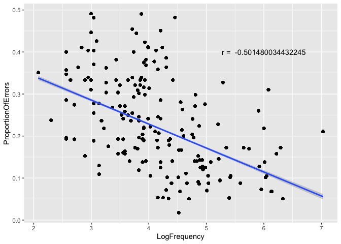

Programming assignment 3
================
Chaoyi Chen
Last update: 2021-02-20

``` r
library(tidyverse)
library(languageR)
```

**EDA\_step 1**: Load the dataset of your choice and get information
about its structure.

``` r
beginningReaders %>%
  str()  # Load the dataset of your choice and get information about its structure 
```

    ## 'data.frame':    7923 obs. of  13 variables:
    ##  $ Word              : Factor w/ 184 levels "avontuur","baden",..: 1 1 1 1 1 1 1 1 1 1 ...
    ##  $ Subject           : Factor w/ 59 levels "S10","S12","S13",..: 14 25 23 43 34 26 21 28 39 24 ...
    ##  $ LogRT             : num  7.41 8.07 6.74 7.02 7.17 ...
    ##  $ Trial             : int  190 298 172 295 74 446 94 415 342 361 ...
    ##  $ OrthLength        : int  8 8 8 8 8 8 8 8 8 8 ...
    ##  $ LogFrequency      : num  4.39 4.39 4.39 4.39 4.39 ...
    ##  $ LogFamilySize     : num  1.61 1.61 1.61 1.61 1.61 ...
    ##  $ ReadingScore      : int  39 34 61 66 41 23 28 60 87 39 ...
    ##  $ ProportionOfErrors: num  0.0877 0.0877 0.0877 0.0877 0.0877 ...
    ##  $ PC1               : num  -0.427 0.883 -1.008 -0.124 -0.489 ...
    ##  $ PC2               : num  0.179 -0.591 0.374 0.121 -0.958 ...
    ##  $ PC3               : num  0.09977 -0.9283 -0.00244 0.76438 0.19308 ...
    ##  $ PC4               : num  0.1031 -1.6583 -0.0156 0.3885 -1.28 ...

**EDA\_step 2**: Tidy the dataset (every variable gets a column, every
observation occupies a single row), if necessary.

``` r
beginningReaders %>% 
pivot_longer(.,cols = PC1:PC4, 
             names_to = "PC", values_to = "PC_value") # Tidy the dataset (every variable gets a column, every observation occupies a single row), if necessary.
```

    ## # A tibble: 31,692 x 11
    ##    Word  Subject LogRT Trial OrthLength LogFrequency LogFamilySize ReadingScore
    ##    <fct> <fct>   <dbl> <int>      <int>        <dbl>         <dbl>        <int>
    ##  1 avon… S28      7.41   190          8         4.39          1.61           39
    ##  2 avon… S28      7.41   190          8         4.39          1.61           39
    ##  3 avon… S28      7.41   190          8         4.39          1.61           39
    ##  4 avon… S28      7.41   190          8         4.39          1.61           39
    ##  5 avon… S40      8.07   298          8         4.39          1.61           34
    ##  6 avon… S40      8.07   298          8         4.39          1.61           34
    ##  7 avon… S40      8.07   298          8         4.39          1.61           34
    ##  8 avon… S40      8.07   298          8         4.39          1.61           34
    ##  9 avon… S37      6.74   172          8         4.39          1.61           61
    ## 10 avon… S37      6.74   172          8         4.39          1.61           61
    ## # … with 31,682 more rows, and 3 more variables: ProportionOfErrors <dbl>,
    ## #   PC <chr>, PC_value <dbl>

**EDA\_step 3**: Calculate descriptive statistics of your choice.

``` r
beginningReaders %>%
summary()# Calculate descriptive statistics of your choice.
```

    ##        Word         Subject         LogRT           Trial      
    ##  mus     :  56   S46    : 180   Min.   :5.545   Min.   :  1.0  
    ##  poes    :  56   S52    : 177   1st Qu.:7.001   1st Qu.:126.0  
    ##  sok     :  56   S12    : 174   Median :7.329   Median :242.0  
    ##  oom     :  55   S63    : 174   Mean   :7.318   Mean   :247.8  
    ##  plein   :  55   S74    : 172   3rd Qu.:7.657   3rd Qu.:370.0  
    ##  sprookje:  55   S75    : 171   Max.   :8.294   Max.   :567.0  
    ##  (Other) :7590   (Other):6875                                  
    ##    OrthLength      LogFrequency   LogFamilySize    ReadingScore  
    ##  Min.   : 2.000   Min.   :2.079   Min.   :0.000   Min.   :10.00  
    ##  1st Qu.: 5.000   1st Qu.:3.584   1st Qu.:1.099   1st Qu.:29.00  
    ##  Median : 6.000   Median :4.143   Median :1.386   Median :46.00  
    ##  Mean   : 5.769   Mean   :4.218   Mean   :1.504   Mean   :47.61  
    ##  3rd Qu.: 7.000   3rd Qu.:4.860   3rd Qu.:1.792   3rd Qu.:65.00  
    ##  Max.   :11.000   Max.   :7.029   Max.   :3.807   Max.   :96.00  
    ##                                                                  
    ##  ProportionOfErrors      PC1                PC2                 PC3          
    ##  Min.   :0.01754    Min.   :-6.74895   Min.   :-3.571122   Min.   :-3.35566  
    ##  1st Qu.:0.13793    1st Qu.:-0.85291   1st Qu.:-0.461370   1st Qu.:-0.43199  
    ##  Median :0.19643    Median : 0.20943   Median :-0.009402   Median :-0.00131  
    ##  Mean   :0.21607    Mean   : 0.04015   Mean   : 0.000145   Mean   :-0.00295  
    ##  3rd Qu.:0.29825    3rd Qu.: 1.13255   3rd Qu.: 0.462891   3rd Qu.: 0.41571  
    ##  Max.   :0.49123    Max.   : 3.38085   Max.   : 4.172695   Max.   : 2.97171  
    ##                                                                              
    ##       PC4           
    ##  Min.   :-3.055159  
    ##  1st Qu.:-0.405996  
    ##  Median : 0.005431  
    ##  Mean   : 0.002121  
    ##  3rd Qu.: 0.412868  
    ##  Max.   : 2.926385  
    ## 

**EDA\_step 4 and 5**: Select two continuous variables and fit a model
to the data (bivariate regression) and generate a plot that includes a
regression line.

``` r
beginningReaders %>%
  ggplot(., aes(x = LogFrequency, y= ProportionOfErrors)) + 
  geom_point() + 
  geom_smooth(method = lm) + 
  annotate(geom = "text", x= 6, y = 0.4, label = paste("r = ", cor(x = beginningReaders$LogFrequency, y = beginningReaders$ProportionOfErrors))) # Select two continuous variables and fit a model to the data (bivariate regression) and generate a plot that includes a regression line.
```

<!-- -->

**EDA\_step 6**: Write up some general observations (1-2 paragraphs max)

The plot in question describes the correlation between log-transformed
frequency in Vermeer’s frequency dictionary of Dutch children’s texts
and the proportion of error responses for the word. The slope value of
the regression line is negative, which indicates that as the frequency
increases, the proportion of error responses decreases. The fitting
value of the proposed model to the data is around 0.5.
